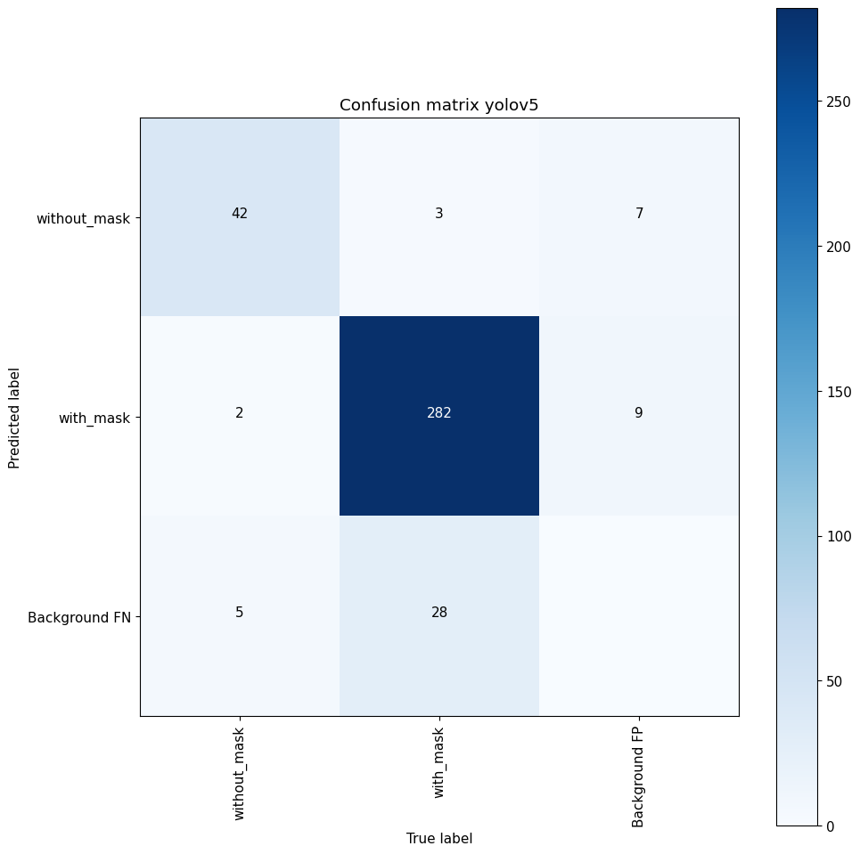
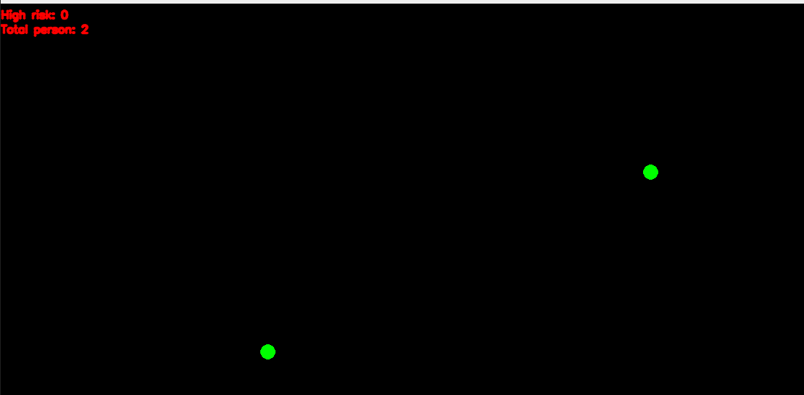
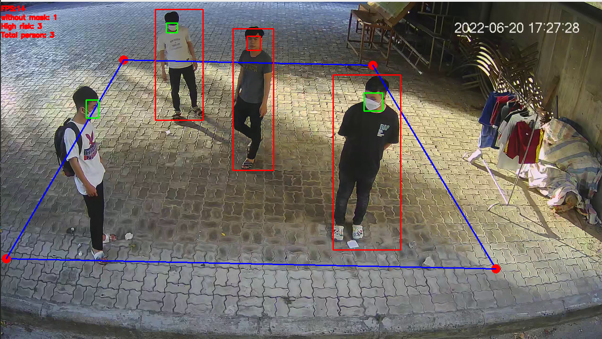

# FACE MASK DETECT AND DISTANCE AND CROWD DENSITY ESTIMATES
## Introduction
This is major project of computer engineering about face mask detect and distance, crowd density estimates

## Dev
```
Member:
 - DAO DUY NGU
 - LE VAN THIEN
Instructor: TRAN THI MINH HANH
```
## Usage
### Install package
```
git clone https://github.com/DuyNguDao/Project-Covid19.git
cd Project-Covid19
conda create --name covid19 python=3.8
pip install -r requirements.txt
```
### Quick start
```
python distance_bird_eyes_video.py
```
## Guides setup distance and Crowd density estimates
```
- Config for camera at bird_eyes_view.yalm
- At the first frame:
    + Click seven point:
      * click first four point: left, top right, bottom right, bottom left
      * click again three point then compute pixel width, height: top left, top right, bottom left
```
## Datasets and result model training
[dataset and result](https://drive.google.com/drive/folders/1jXLMOPBiPNicfkjhB8cHy3mRZSqjK_IE?usp=sharing)

## Result confusion matrix on set of YOLOv5
### Plot train

### Train

### Test

## Compare between model YOLOv5 and RetinaFace + MobileNetV2
### Confusion matrix of YOLOv5

### Confusion matrix of RetinaFace + MobileNetV2

## Result realtime
* Frame 1


* Frame 2


* Frame 3



## Contact
```
email: ddngu0110@gmail.com
phone: 
+ Ngu Dao Duy (+84978879560)
+ Thien Le Van (+84329615785)
```
